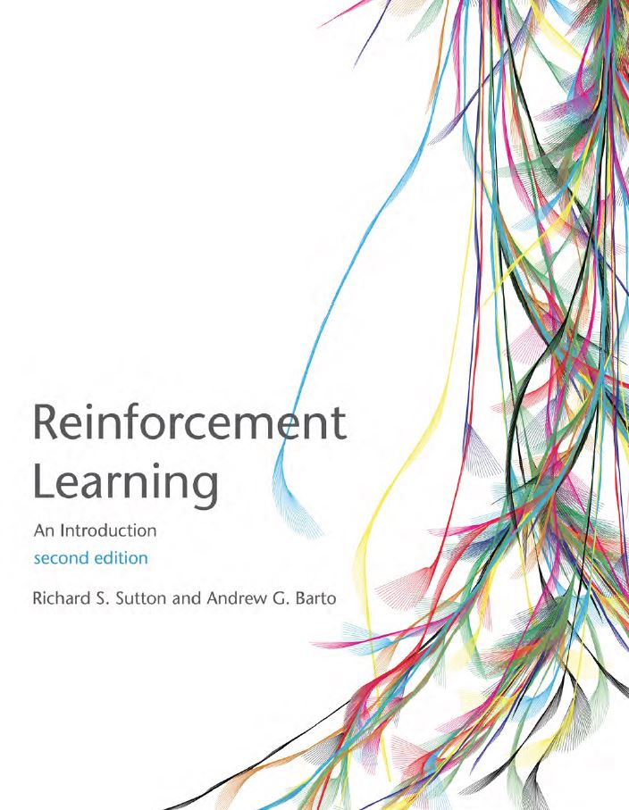

# Reinforcement Learning (Sutton et. al)

This repository is for our codes, experiments and answers to Sutton's book exercises and algorithms.

*R. S. Sutton and A. G. Barto.Reinforcement Learning: An Introduction(The MIT Press, 2018),second ed.*

